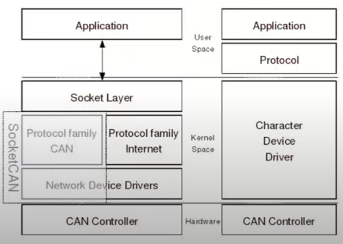
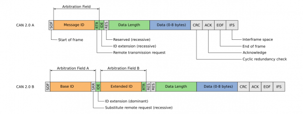
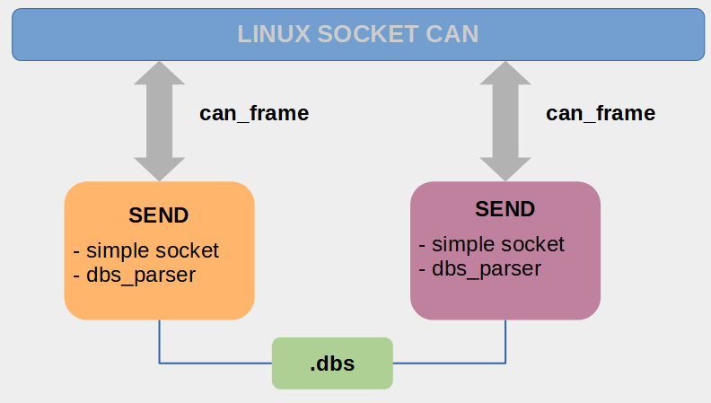
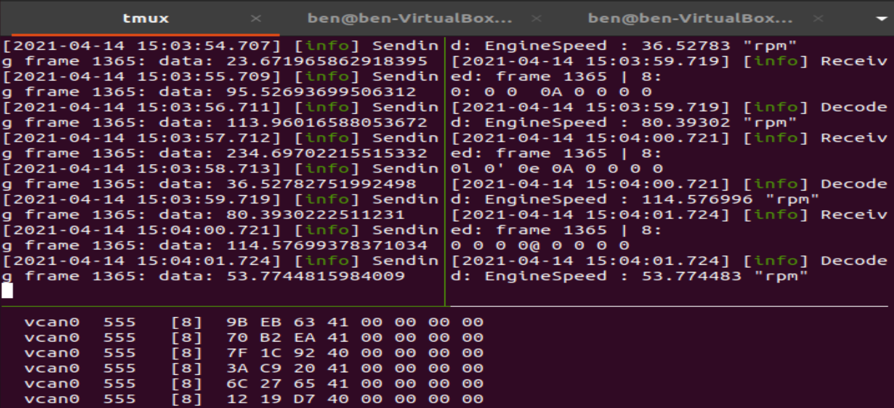

# Learning About CAN

Learning about CAN and Linux Socket CAN.

This document tries to summarize basic explanations and useful links-resources
to understand how CAN works, and presents some tools to start prototyping.

It also contains a simple project based on CAN-socket that's can be useful to explore a bit CAN with simple code.

## Introduction
CANBUS (Control Area Network) is a widespread networking technology is the automobile industry, automation and embedded system.

- [Wikipedia introduction](https://en.wikipedia.org/wiki/CAN_bus#:~:text=A%20Controller%20Area%20Network%20(CAN,applications%20without%20a%20host%20computer.)
- [csselectronics - intro](https://www.csselectronics.com/screen/page/simple-intro-to-can-bus/language/en)
- [CAN dictionary by kvaser ](https://www.kvaser.com/about-can/can-dictionary/)
- [Good introduction to CAN video 1 - Eric Evenchick](https://www.youtube.com/watch?v=U1yecKUmnFo)
- [CANBus sparkfun](https://learn.sparkfun.com/tutorials/ast-can485-hookup-guide/introduction-to-can-bus#:~:text=Packet%20Structure,CRC%20and%20other%20control%20bits.&text=The%20message%20ID%20is%20also,transmit%20at%20the%20same%20time.)

## ISO model


CAN model are based on [ISO_15765](https://en.wikipedia.org/wiki/ISO_15765-2) and [ISO 11898 ](https://www.iso.org/standard/63648.html).

### Hardware

This section sum-up information about CAN related hardware information.

- [CANBUS 2 wired video explanation](https://www.youtube.com/watch?v=3lkfK2-BUno)
- [CANBUS 2 wired video troubleshooting](https://www.youtube.com/watch?v=ulcKnrPmJqM)

#### Type
##### High-Speed CAN

A multi-star configuration seems typical of this bus with a primary bus line that branches into sub bus lines at its extremities then attaches to multiple device nodes. Differential voltage is applied over twisted pair at 1.5 to 2.5V and 2.5 to 3.5V for noise resistant signaling. Bit rates up to 1 Mbit/s are possible at network lengths below 40 m. Decreasing the bit rate allows longer network distances (e.g., 500 m at 125 kbit/s).

It also exist low speed CAN and CANFD.

#### Hardware solutions
The section list the some devices available on the market:
- [vector website](https://www.vector.com/jp/ja/know-how/beginners/beginners-cancan-fd-jp/)
- [cheap bluetooth](https://is.gd/2GJb2c)
- [cantact - opensource](https://cantact.io/cantact-pro/users-guide.htm)

### CAN packets

#### Structure
Image from Sparfun:



- SOF: The Start of Frame is a 'dominant 0' to tell the other nodes that a CAN node intends to talk
- ID: The ID is the frame identifier - lower values have higher priority
- RTR: The Remote Transmission Request indicates whether a node sends data or requests dedicated data from another node
- Control: The Control contains the Identifier Extension Bit (IDE) which is a 'dominant 0' for 11-bit. It also contains the 4 bit Data Length Code (DLC) that specifies the length of the data bytes to be transmitted (0 to 8 bytes)
- Data: The Data contains the data bytes aka payload, which includes CAN signals that can be extracted and decoded for information
- CRC: The Cyclic Redundancy Check is used to ensure data integrity
- ACK: The ACK slot indicates if the node has acknowledged and received the data correctly
- EOF: The EOF marks the end of the CAN frame

#### CAN BDS
**CAN BDS** files content the database used to encode and decode CAN messages.
They basically match CAN message to a meaningful information.

1. Match CANID to BDSID
For 11-bits ID, we can just match the decimal CANID to DBSID. For extended ID (29-bits), we need to apply a mask to the 32-bits DBSID to get the 29-bits CANID.

2. Understand related signal
The DBSfile provides ```signal information``` to decode the message.
This signal include:
- Start bit: where the information is content in the payload.
- Length: the actual length of the data.
- Encoding type: LittleEndian vs BigEndian.
- Signed or Unsigned Value.
- Scale and Offset: used to convert the data.
- Data range.
- Unit of the value.

3. Decode Value
Once the signal information is extracted, the value can be read from the payload, and then converted into meaningful data:
```
meaningful_value = scale * raw_value_decimal + offset
```

4. Other part of DBS
The DBS file content other information:
- Comment for message or signal
- Add attribute to message: format, version, multiplexing messages, ...

- [DBS file explained](https://www.csselectronics.com/screen/page/can-dbc-file-database-intro/language/en)
- []

## Simple application
In order to get familiar with CAN, we tried to write a simple application:
- Encode simple BDS messages.
- Send CAN message over CANBus.
- Read CAN message over CANBus.
- Decode simple BDS messages.



### Development environment
On Ubuntu, we can use the available Linux Socket CAN, and related tools:
```bash
sudo modprobe vcan
```

Install the tools:
```bash
sudo apt install can-utils
```

Also [Wireshark](https://wiki.wireshark.org/CANopen) allows to dump, filter CAN socket packages.

- [socketCAN description (elinux)](https://elinux.org/CAN_Bus)
- [github can-utils](https://github.com/linux-can/can-utils)

### Run the application
#### Dependencies
Please install:
- [spdlog](https://github.com/gabime/spdlog): a header only logging librar.
- [boost](https://www.boost.org): used for program option, but can be use next for parsing.

```
sudo apt install libspdlog-dev libboost-all-dev
```

#### Make and Run

1] bring up the virtual can up
```./setup_vcan0.sh```

2] ```make```

3] run in two terminal:
```shell
./CAN_send.exe --dbs dbs/simplified.bds
./CAN_read.exe --dbs dbs/simplified.bds
```




#### Similar project links:
- [Simple SocketCan in C](https://www.beyondlogic.org/example-c-socketcan-code/)
- [C++ SocketCAN project](https://github.com/siposcsaba89/socketcan-cpp)
- [DBS parser project - 1](https://github.com/xatavian/cpp-can-parser)
- [DBS parser project - 2](https://github.com/astuff/can_dbc_loader)
- [DBS parser project - 3](https://github.com/cymatics1717/cantest)
- [DBS parse project - 4](https://github.com/xR3b0rn/dbcppp)

## Conclusion

CAN can seems quite forward on the first view, but a deeper look raise a lot of technical points: requiring quite a lot of low level management. (at least for me :)

### ToDo

For documentation:
- a modern status on CAN: what is the latest?
- more complete

For the small application:
- SocketCAN for extended ID.
- a real DBS parser: all support, generating code
- Research and implement a more real data formatter: ```frame.data <=> float```, taking in account endianness, start, ect...
- optimize Makefile with .o
- check some RUST implementation

### Others Resources

- [ID convertion stackoverflow](https://stackoverflow.com/questions/57986218/reading-can-bus-in-c-displays-incorrect-can-id-for-29-bit-can-id)
- [C-API](https://github.com/ejvaughan/obdii)
- [a guide to odbii app dev](https://lembergsolutions.com/blog/how-guide-obdii-reader-app-development)
- [CAN on  a RPi](https://www.hackster.io/youness/how-to-connect-raspberry-pi-to-can-bus-b60235)
